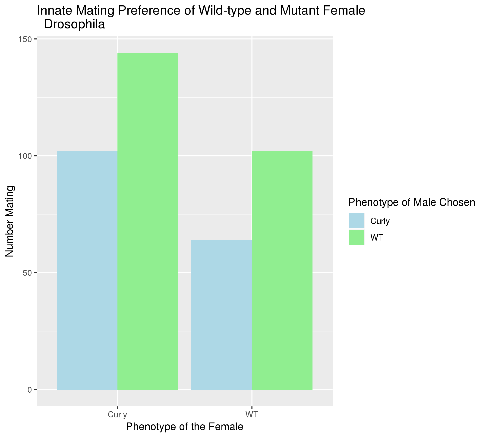
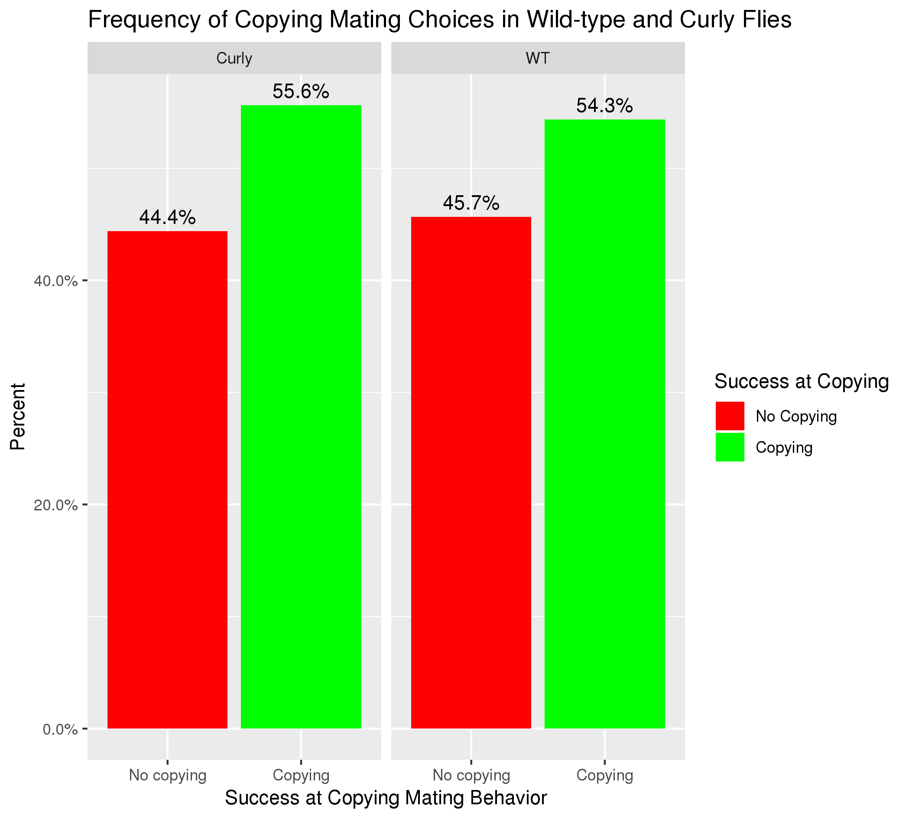

# Data Summary by Ashley Ewing

## Overview of Data
I used data from https://datadryad.org/bitstream/handle/10255/dryad.182697/Data-set%20Mate-copying%20of%20a%20costly%20variant%20.xlsx which describes Drosophila mating preferences between wild-type and Curly mutant flies when they are observing mating occurring between two flies before they mate themselves. The researchers wanted to know if the females would copy the behavior they observed even if it meant mating with a mutant, in this case, the Curly mutant.

## Q1: Do female Drosophila naturally prefer mating with wild-type or Curly mutant flies?

This plot shows that both curly and wild-type female Drosophila prefer to mate with wild-type flies. It is interesting that even the curly mutant female flies prefer wild-type over the male flies that have the same mutation as them, curly. This may be because mating with curly mutants would be a fitness cost and result in offspring that are less healthy than wild-type.

## Q2 Does watching Curly Flies Mating Change Female DrosophilaPreference?

This plot shows the mating preference of female Curly and wild-type Drosophila after watching Curly mutants copulate (mate) with another female. The informed females observed this copulation, while the uninformed did not. This plot shows that among both Curly and wild-type flies, after watching copulation with a Curly mutant (the informed groups), the females preferred mating with Curly flies over wild-type. However, in the uninformed Curly group, we would expect that the preference would be for wild-type, as shown in the previous figure, but instead we see a preference for curly as well. The change in preference is only seen in wild-type flies. In the uninformed group, the flies prefer mating with wild-type, while in the informed group, the flies prefer mating with Curly. This shows that the wild-type flies are exhibiting mate-copying, in which they copy the mating behavior of other flies.

## Q3 What is the difference in the wild-type and curly mutants ability to copy the mating they observe?
1 = observer female chose same male phenotype
0 = observer female chose male phenotype

